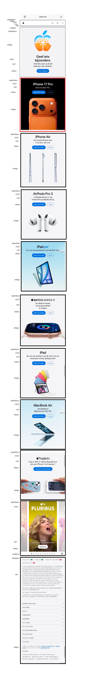
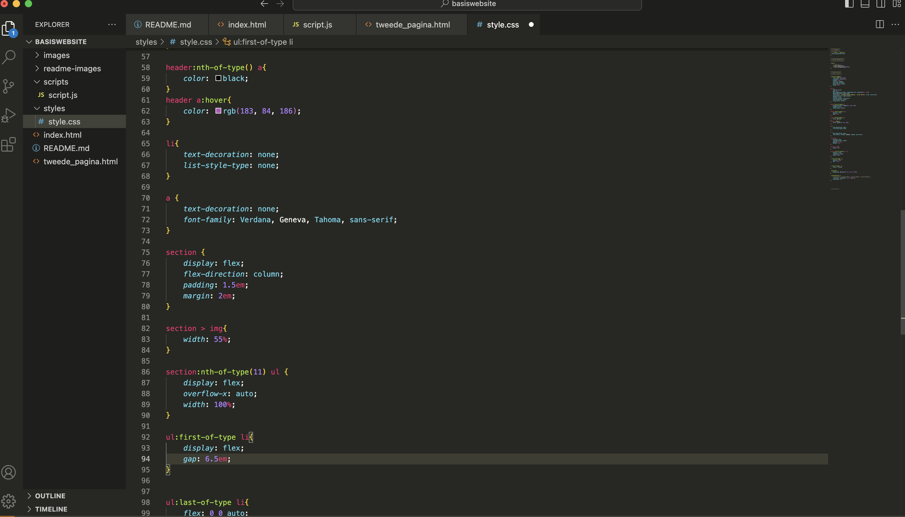
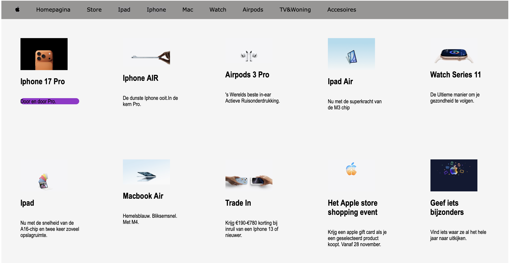
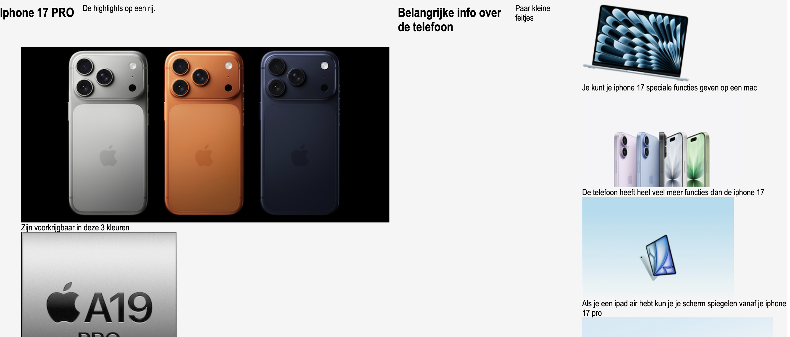
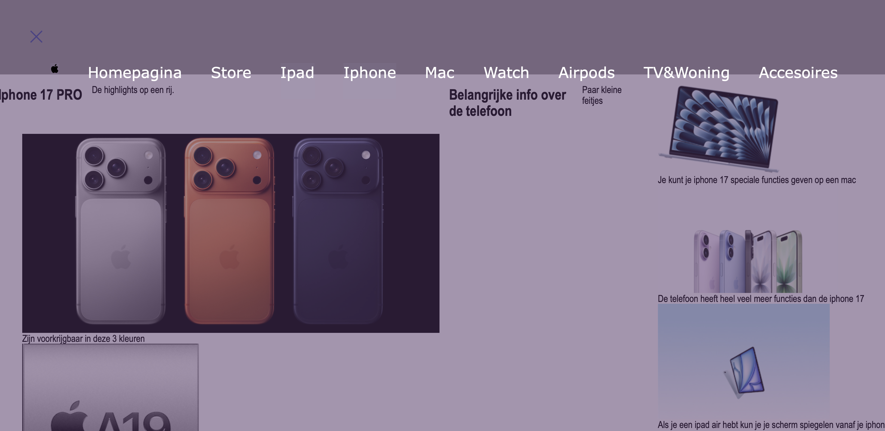
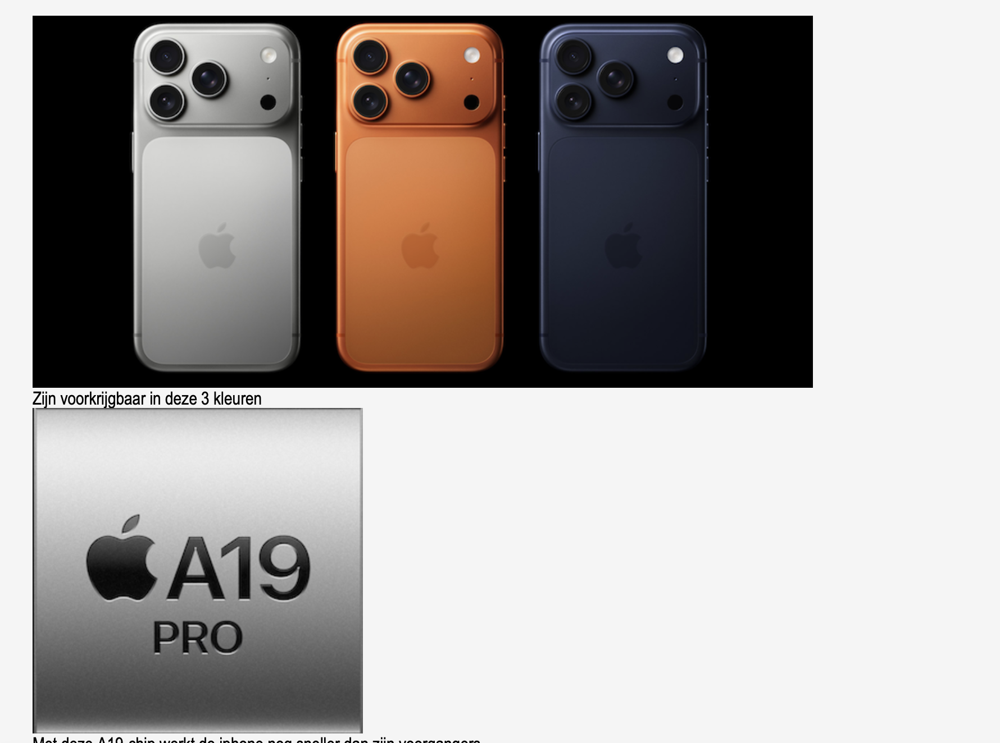
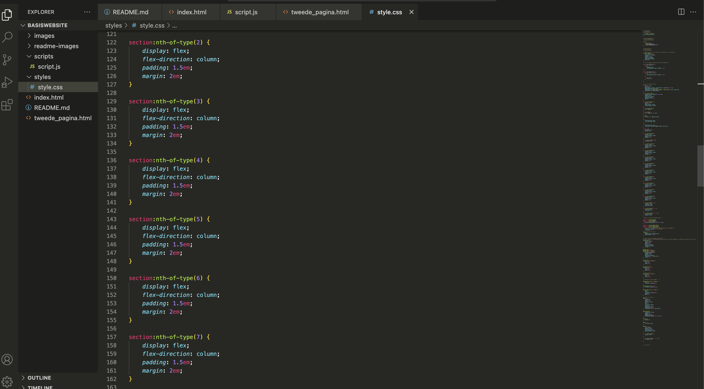

# Procesverslag
Markdown is een simpele manier om HTML te schrijven.  
Markdown cheat cheet: [Hulp bij het schrijven van Markdown](https://github.com/adam-p/markdown-here/wiki/Markdown-Cheatsheet).

Nb. De standaardstructuur en de spartaanse opmaak van de README.md zijn helemaal prima. Het gaat om de inhoud van je procesverslag. Besteedt de tijd voor pracht en praal aan je website.

Nb. Door *open* toe te voegen aan een *details* element kun je deze standaard open zetten. Fijn om dat steeds voor de relevante stuk(ken) te doen.

## Jij

  
uitwerken voor kick-off werkgroep

  ### Auteur:
  Cheyenne van der Spijt

  #### Je startniveau:
  Blauw

  #### Je focus:
  Responsive
 

## Je website

  
uitwerken voor kick-off werkgroep

  ### Je opdracht:
  https://www.apple.com/nl/ 

  #### Screenshot(s) van de eerste pagina (small screen): 
  Apple 
  

  #### Screenshot(s) van de tweede pagina (small screen):
  Iphone 17 Pro 
  
 

## Toegankelijkheidstest 1/2 (week 1)

  
uitwerken na test in 2e werkgroep

  ### Bevindingen
  Lijst met je bevindingen die in de test 1 naar voren kwamen:
  Ik heb ernaar gekeken samen met Nicky en wij waren er samen uitgekomen, dat de site niet echt zo toegankelijk als dat we eerst dachten. Want het was was best moeilijk om de site door te komen vanwege de vele animaties die in de site aanwezig zijn. Veel daarvan zijn mooi om te zien als je door de site heen zou kunnen scrollen. Maar omdat je met de voice-over tool vooral werkt met knoppen zijn de animaties ook anders te beleven.

  En ook vooral met Voiceover waren de opties niet zo uitgebreid als we dachten op de Apple site. Bij andere sites was het gemakklijker om bijvoorbeeld onderdelen van de site over te slaan, daar was een optie voor op meerdere sites (zoals youtube).

  Met de Voice-over tool werken vond ik zelf best nog wel lastig, ookal had was er een hele instructutie pagina voor. Dus ik hoop dat het voor mezelf niet al te lastig wordt om deze goed te laten doorlopen in mijn eigen site.

## Breakdownschets (week 1)

  
uitwerken na afloop 3e werkgroep

  ### de hele pagina: 
  

  ### dynamisch deel (bijv menu): 
  

  ### wellicht nog een dynamisch deel (bijv filter): 
  

## Voortgang 1 (week 2)

  
uitwerken voor 1e voortgang

  ### Stand van zaken
  In het begin heb ik vooral getwijfeld over de site waaraan ik wilde werken maar ik ben toch bij apple gebleven. De html van de twee pagina's heb ik tot nu toe afgekregen. En heb ik nog niet door kunnen werken aan de Css maar dat is voor deze week nog niet nodig.

  ### Agenda voor meeting

  Daar hebben we niet van te voren met de hele groep kunnen kijken. Maar ik heb met 1 andere student uit mijn groepje kunnen bespreken waar zij vragen over had. En daar kwam uit dat we vooral wilde weten hoe het eerste voortgangs gesprek zou zijn en als we dan vragen zouden hebben dat we die dan tijdens de bespreking zouden vragen.

  ### Verslag van meeting

  Student 1 (Victoria)
  Je hoeft geen P te maken om tekst neer te zetten bij een link
  Img hoef je niet in een figure te wrappen
  Als je in je header veel linkjes heb is het gebruikelijk om een nav te maken.

  Student 2 (Juliette)
  Aria- label bij een link als je het voor de screen reader maken
  Bij elke section moet een heading (bij 1 zit een p)
  Html in het engels dus bovenste regel veranderen
  Breakdown klopt

  Student 3 (Sana)
  Bij de breakdown ook de elementen aanwijzen
  Extension om je document netter neer te zetten (format document)
  Tekst over video kan pas bij css.

  Student 4 (ik)
  Bij section beginnen met h3 om de tekst kleiner te maken dan h1 en h2 kan niet. Het kan alleen als er boven een h2 is. Dus h2 doen en op een andere manier de styling aanpassen.
  Details elementen toepassen.
  Footer hoeft geen heading te hebben.
  Link met een # zorgt ervoor dat die weer naar het begin van de pagina springt. (Gebruiken voor links die je niet gaat gebruiken)
 
  Student 5 (Ana)
  Als je iets ergens kan invullen is dat input
  De list zelf is de ul en daar zitten li’s in.

## Voortgang 2 (week 3)

  
uitwerken voor 2e voortgang

  ### Stand van zaken
  In deze week ben ik heel erg bezig geweest met mijn css in elkaar zetten. Ik heb nog wel moeite met de nieuwe manier van css gebruik, ik heb het namelijk vorig jaar op een simpele manier geleerd. En het is voor mij daardoor wel lastiger geworden, om de css goed erin te zetten. Ik heb wel verschillende websites gezocht waar ik dan met selectors zou kunnen oefenen. 

  En door persoonlijke omstandigheden kon ik niet bij dit voortgangs gesprek zijn maar ik heb wel tussendoor in de lessen gevraagd naar feedback. En die vragen ga ik dan stellen in de volgende lessen.

  ### Agenda voor meeting
  De vragen die ik zelf heb gingen vooral over het indelen van de css. En of ik wel op de goede weg was.

  ### Verslag van meeting

  De feedback die ik heb gekregen tijdens de lessen ging er dus vooral om dat ik echt moest gaan oefenen met selector oefeneningen zodat ik beter ging begrijpen hoe het in elkaar zit. 
  Want met de css die ik nu heb is het te generiek en nog niet compleet.
  

## Toegankelijkheidstest 2/2 (week 4)

  
uitwerken na test in 9e werkgroep

  ### Bevindingen
  Ik heb naar mijn site gekeken samen met Nomi, maar ik kon nog niet zoveel bevindingen doen. Omdat ik nog niet zo ver was met mijn onderdelen voor accesability voor mijn eigen website. Heb ik dat nog niet zo kunnen testen maar ik heb wel de opdrachten zo goed mogelijk uitgevoerd. Ik dacht namelijk al dat mijn site zo ver was dat hij al responsive was voor mijn telefoon maar ik had dus nog geen media query erin staan. Maar omdat ik dus niet zo ver was met mijn eigen site op dat moment. Kon ik al wel de aanpassingen op mijn site aanbrengen die de orginele apple site nog niet heeft. 
  Nu weet ik dus wel wat mijn site nodig heeft om zo toegangkelijk mogelijk te zijn zoals een skip-link om gelijk naar de content in de main te gaan. En goede alt teksten zodat de juiste namen worden opgelezen bij de plaatjes.

## Voortgang 3 (week 4)

  
uitwerken voor 3e voortgang

  ### Stand van zaken
  Voor nu heb ik alles gemaakt voor een responsive website. Ik heb alleen de animaties gemaakt met classes. Maar die mogen niet dus dan moet ik darvoor feedback vragen. Ook heb ik moeite om mijn afbeeldingen in de overflow kleiner te maken want de css werkt wel maar alleen de afbeeldingen reageren niet.

  ### Agenda voor meeting
  We gaan met de aanwezige mensen uit de groep beurt voor beurt vragen stellen op basis van wie de meeste vragen had.

  ### Verslag van meeting
  hier na afloop snel de uitkomsten van de meeting vastleggen
  Ik heb tijdens de meeting hulp gekregen bij mijn animaties ik heb ze nu erin gekregen zonder classes. Ook heb ik een oplossing gevonden voor de afbeeldingen die in de overflow moesten staan. Het probleem was dat ik ze niet verder kan bewerken omdat ze in de grid stonden. Maar nu ik ze in de footer heb gezet lukte het me wel om te bewerken.

## Eindgesprek (week 5)

  
uitwerken voor eindgesprek

  ### Je uitkomst - karakteristiek screenshots:
  
  

  ### Dit ging goed/Heb ik geleerd: 
  Korte omschrijving met plaatjes

  
  Deze opdracht ging goed omdat ik deze precies heb kunnen toepassen als in de les en daar ben ik wel trots op.
  
  Ik was heel blij met het hamburger dat het werkte met alle animaties die erbij hoorde van de site. Want het was wel een onderdeel die ik vond passen bij mijn site.

  ### Dit was lastig/Is niet gelukt:
  Korte omschrijving met plaatjes

  
  Het is me bij deze foto's niet gelukt om ze kleiner te maken met css wat ik wel jammer vond. Dus ik heb ze kleiner op moeten slaan.
  
  Bij bepaalde onderdelen heb ik de css te lang uitgeschreven sommige onderdelen zijn ook onnodig.

## Bronnenlijst

  
continu bijhouden terwijl je werkt

  Nb. Wees specifiek ('css-tricks' als bron is bijv. niet specifiek genoeg). 
  Nb. ChatGpT en andere AI horen er ook bij.
  Nb. Vermeld de bronnen ook in je code.

  1. https://codepen.io/yuzub/pen/XaPjoB > Hiervan heb ik de animatie in headers overgenomen 
  2. https://codepen.io/Chey-hva/pen/yyOOejG > hiervan heb ik responsive grid overgenomen
  3. https://codepen.io/shooft/pen/KwdeqrK >  hiervan komt de sticky header
  4. https://codepen.io/shooft/pen/XJmEOyb > Hiervan heb ik de horizontale scrollbare content
  5. https://www.w3schools.com/accessibility/accessibility_skip_links.php > voor de skip link
  6. Media queries uit de slides van de les
  7. Chatgpt met de prompt "Kan je mijn code goed in laten springen?"

